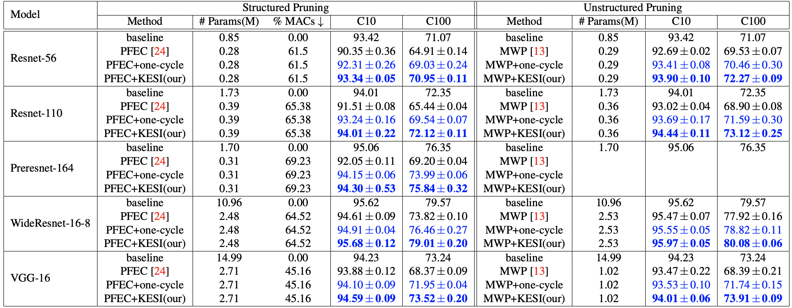
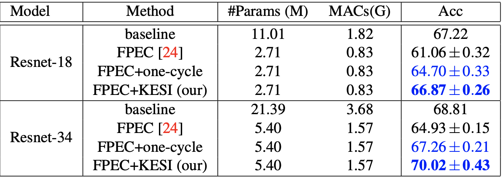

# Gift from Iterative Network Pruning 
This repository contains the code for reproducing the results for paper [Paying more attention to Snapshot of Iterative Pruning: Improving Model Compression via Ensemble Distillation](https://arxiv.org/pdf/2006.11487.pdf) (BMVC 2020).

## Summary

In short, the paper propose to leverage the snapshots of iterative pruning to construct ensembles and distilling knowledge from them. To stimulate the diversity between each snapshots, we use *One-cycle schedule* to retrain the pruned networks. Thus, each snapshot is encouraged to converge to different optimal solution.

The algorithm is summarized below:

1. **Train** the baseline network to completion.
2. **Prune** redundant weights (based on some criteria).
3. **Retrain** with *One-cycle learning rate*.
4. **Repeat** step 2 and 3 until desired compression ratio is reached.
5. **Distill** knowledge from ensemble to desired network.

## How to run

Please checkout `example.pynb` for detail instruction to reproduce the results on CIFAR. Instruction for running experiments on Tiny-Imagenet might be updated later.

We also provided the scripts for repeative pruning and knowledge distillation (read Sec.5 in Colab example). **Disclamer**: you might have to modify the `checkpoint_paths` variable in `ensemble_finetune.py` to appropriate paths (and by that I mean `cifar/filter_pruning/ensemble_finetune.py`,  `cifar/weight_pruning/ensemble_finetune.py`,... depending on your chosen method/dataset).

## Results

### CIFAR-10 and CIFAR-100. 

### Tiny-Imagenet 

**PFEC** and **MWP** stand for [Pruning Filters for Efficient ConvNets](https://arxiv.org/abs/1608.08710) and [Learning both Weights and Connections for Efficient Neural Networks](https://arxiv.org/abs/1506.02626) respectively.

## Acknowledgement 
The code is mostly taken from [Eric-mingjie's repository](https://github.com/Eric-mingjie/rethinking-network-pruning)
